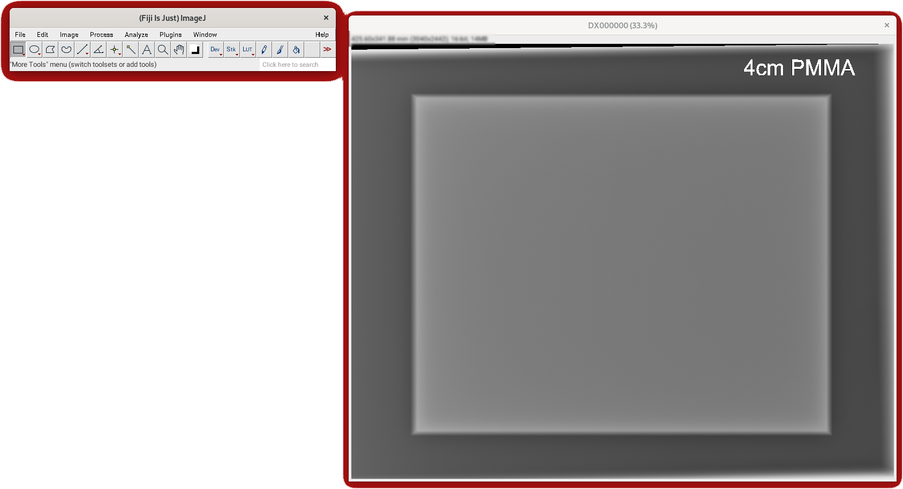
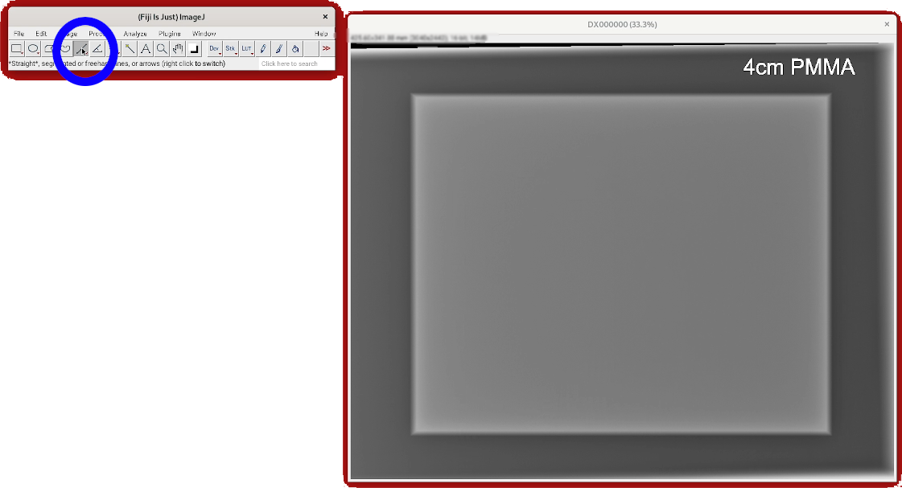

# Lab 1 -- Image Analysis Using ImageJ/Fiji

- (worth 5% of Assignment 1)
- Deadline: 06/10/2022 at 23:59
- Write your answers in the template provided: [questionnaire.docx](questionnaire.docx)

## Introduction

The purpose of this lab is to introduce you to the use of ImageJ2 . In practice, we will use Fiji . Fiji is an image processing package, a "batteries-included" distribution of ImageJ2, bundling a lot of plugins which facilitate scientific image analysis.

This week we will start working on how images are stored. Is an image in greyscale or in colour (see `Pixel Types` in the mindmap below)? Are the pixels stored in unsigned integers values using 8 bits (`unsigned char` in C/C++ and `np.uint8` in a numpy array) or floating point numbers or something else (see `Data Types` in the mindmap below)? And why it matters.

We will use a real medical radiograph to perform some measurements in the image.
The image file is stored in the DICOM format. This is the format used to store most medical images. It's the "JPEG format of medicine".

This lab is designed so that you can complete it during the lab session in less than two hours. Do not hesitate to ask for help! Both the lab assistant and myself are paid to answer your questions (if appropriate) ;-)
You must answer all the questions below and submit a report that contains them before next lab. Use the template I provide here to complete the lab.

## Preliminaries

    Is it installed?

The first thing to do is check if  is installed. Make sure it is on the lab machine and your home computer/laptop. Installing  is trivial. Just download the archive corresponding to your operating system, and extract it somewhere in your home directory. You'll find the program at https://imagej.net/Fiji/Downloads](https://imagej.net/Fiji/Downloads) or below:

- 
- 
- 

## Launch 

Identify the executable file and double-click on:

- : look for `ImageJ-win64.exe` in `path_where_you_extracted_the_archive/Fiji.app/`
- : look for `Fiji.app` in `path_where_you_extracted_the_archive`
- : look for `ImageJ-linux64` in `path_where_you_extracted_the_archive/Fiji.app/`

## Main window and menus

First, you must get familiar with the user interface.

### Main windows

It will appear on your screen. Do not resize it! This window has a Menu Bar, a Tool Bar (all the icons you can see) and a Status Bar (it will display some information when you move the cursor over an image).

### File menu

I mostly use this menu to:

- open existing files
    - from the disk or
    - from ImageJ test image database,
- import RAW files in binary or ASCII,
- import a sequence of 2D images, and
- save images.

### Edit menu

I am sure you are already familiar with the `undo` functionality of a text editor. It's the same, but for an image editor. `Cut`, `Copy` and `Paste` are local to ImageJ. If you want to copy an image, or part of it, and paste it into let's say Word, you must use `Copy to System`.

I do not use other options very much, although they are sometimes useful to clear an area of the image or inverse its values.

### Image menu

I use it ALL THE TIME. `Type` is used to change the data type used to store a pixel (8 bits, 16 bits or 32 bits, and greyscale or RGB). `Adjust` is used to control various values. `Brightness/Contrast` and `Threshold` are particularly useful.

To show a greyscale image in colour, `Lookup Tables` is used.
Other useful options are `Crop`, `Scale`, and `Transform`.

### Process menu

I use it ALL THE TIME. It is used to process the image, e.g. applying mathematical functions to images, or applying image filters.

### Analyse menu

I use it ALL THE TIME to compute image statistics (min, max, average... pixel values), and compute histograms.

### Plugins

All the plugins. There are too many to describe them here.

### Window

I use it to find a window I "lost".

### Help

I don't use it so much.

## Find the size of a PMMA block in an X-ray image

1. Download [DX000000](https://github.com/effepivi/ICE-3111-Computer_Vision/raw/main/Labs/Lab-01/DX000000).
2. Open `DX000000` via `File → Open`.
3. You should see this now:

*DICOM file courtesy of Dr Jenna Tugwell-Allsup, Research Radiographer, Betsi Cadwaladr University Health Board, Wales*

4. Locate the status bar in the window that displays the image. See the blue rectangle in the image below:

3. Identify some information from the  status bar:
    1. What is the image size in mm?
    2. What is the image size in pixels?
    3. What is the data type used to store pixels? in other words, you must specify:
        - greyscale vs. colour
        - integer vs. floating point numbers
            - if integer, signed or unsigned,
            - if floating point numbers, single or double precision
        - how many bits per pixels
    4. What is the image size in number of bytes?
        - The total number of pixels is: 
        - The number of values per pixel is 1 for greyscale images; 3 or 4 for colour images.
        - The size in number of bytes is 
    5. How many different pixels values an 8-bit image can have?
    6. How many different pixels values DX000000 can have (in theory)?
    7. What is the "size of a pixel in mm"? (divide the image size in mm by the image size in pixels)
    8. What is the size in both mm and number of pixels of the diagonal of the image. Use Pythagoras' theorem: 

## Measure distances

1. Move the cursor over the image. Keep an eye on the status bar of ImageJ's main window. Describe in your own words what is happening.
2. In the main window, find the icon that displays a straight line and click on it:

3. Move the cursor onto the first pixel of the image (by convention, the top-left corner):

4. Press and hold the left button of the mouse and move it to the last pixel of the image (by convention, the bottom-right corner):

5. Before you release the mouse's button, look at the status bar and note the length of the line segment you just drew.
6. Is the distance given in mm or number of pixels? (compare with the lengths of the diagonal you computed with Pythagoras' theorem)
7. Using the same technique (drawing a line on the image to measure a distance), give the width and height of the object in the centre of the image. Provide the information both in mm and number of pixels.

## Statistical analysis

### Overall image

We want to analyse the statistics of the pixel values.

Two choices:

- Go to the `Analyze` menu and click on `Measure`, or
- Use the shortcut `<CTRL+M>`.

1. What is the smallest pixel value in the image?
2. What is the largest pixel value in the image?
3. What is the average pixel value in the image?
4. What is the standard deviation?
5. What is the dynamic range? ()
6. The intensity histogram is a graph that shows the number of pixels in an image at each different intensity value found in that image. Plot the intensity histogram:
    - Go to the `Analyze` menu and click on `Histogram`, or
    - Use the shortcut `<CTRL+H>`.
7. Save the plot:
    - Click somewhere on the histogram window to make sure it is the active window.
    - Go to the `File` menu and click on `Save as`.
    - Save the image.
    - Add the histogram to your report.
    - Keep the histogram window open, we'll need it later!

### PMMA block

- Select the rectangle tool in the main ImageJ window:

- Draw a rectangle on the image to select the PMMA block as follows:

1. What is the smallest pixel value in the image?
2. What is the largest pixel value in the image?
3. What is the average pixel value in the image?
4. What is the standard deviation?
5. What is the dynamic range? ()
6. Plot the corresponding histogram.
7. Add the histogram to your report.

### Background

Repeat the previous steps for the background as follows:

### Compare the 3 histograms

Organise your screen as I did below:

The main histogram is centred at the top of my screen.
As you noticed, the pixel values of the background are lower than those of the PMMA block. As a consequence I put the histogram of the background on the left-hand side of my screen; and the histogram of the PMMA block on the right-hand side.
Can you see how they relate? You can move the mouse over the plots to see more information. We are trying to locate the pixel intensity that separate the PMMA block from the background. See the red arrow pointing to the middle of the valley between the two peaks below:

Note in your report the corresponding pixel intensity. We'll need it next week!

### Don't forget

To complete the lab report and to submit it.

### Next week

We will exploit this value to perform our first image processing task: Segment the image to select the PMMA block only.
