# Lab 2 -- Further Image Analysis Using ImageJ/Fiji

- (worth 5% of Assignment 1)
- Deadline: 13/10/2022 at 23:59
- Write your answers in the template provided: [questionnaire.docx](https://github.com/effepivi/ICE-3111-Computer_Vision/raw/main/Labs/Lab-02/questionnaire.docx)

## Introduction

Look at the ellipses in the mindmap. It illustrates which concepts we are discussing this week.

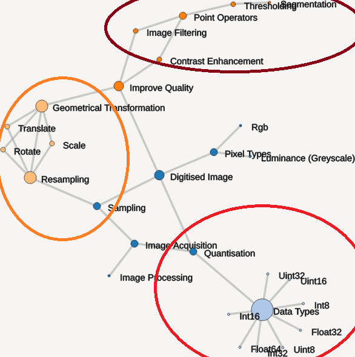

This week we studied sampling and quantisation in the lecture. We saw that the data type used to store pixel values is important in order to retain information (remember when I converted my MP3 into WAV with a low bitrate?!). This is also true with the two images will use today. One is in UINT16 (`unsigned short` in C), one in FLOAT32 (`float` in C). One of the problem with such images, it's that they tend to have a large dynamic range, much wider than what the screen can display.

Today we will:

1. Adjust the brightness and contrast of images so that they look nice to the user but without changing the actual pixel values:
  - We don't want to damage the data,
  - We just want to make it look nice on the screen.
2. Segment (in other word select regions of interest) parts of the image using a method called "thresholding".
3. We use the amount of segmented data relative to the whole image to measure their areas. This technique is useful for complex shapes.
4. We'll do some more measurements, but on another image. The two images that we use are images that I actually used in my research, in other words, they are real images that I must analyse too.

## Preliminaries

We'll use ImageJ/Fiji this week again. Make sure it is installed. [See last week's lab if it isn't](../Lab-01). We will initially use the same image as last week.

## Improving the Brightness and Contrast of the Visualisation

**NOTE: none of the actions that we perform in this section will change the pixel data. We are only tweaking the visualisation of the image.**

1. Download [DX000000](https://github.com/effepivi/ICE-3111-Computer_Vision/raw/main/Labs/Lab-01/DX000000).
2. Open `DX000000` via `File → Open`.

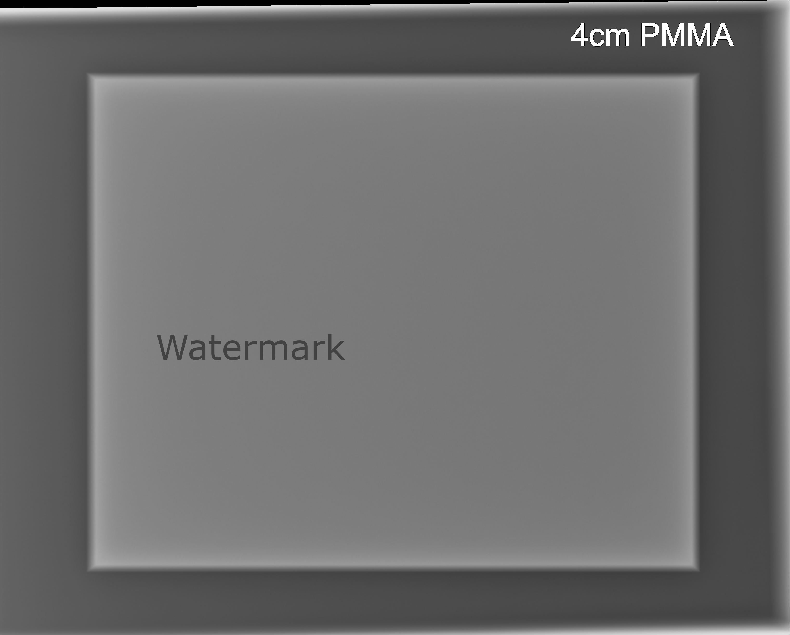

3. I don't know how about you, but I find the image a bit dull.  
    - The dynamic range of the image is [0 - 16383], with 0 the smallest pixel value in the image; and 16383 the largest one.

    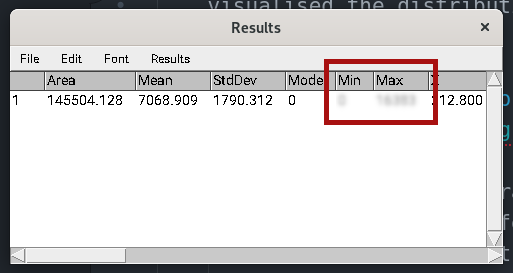

    - Why 16383?
        - 16 bits are used to store a pixel value.
        -  
        - However, only 14 bits are needed for X-ray radiographs.
        -  
        - The largest value using 14 bits is 16383.
    - In the histograms you computed last week, we visualised the distribution of pixel values in a graph:

    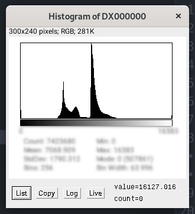

    - A lot of the dynamic range is not actually conveying meaningful information:
        - See the tails of the histogram.

        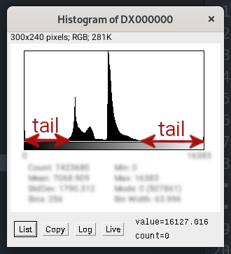

        - The important information is
        important in the middle of the range:

        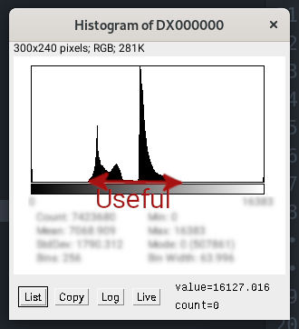

    - To improve the brightness/contrast of the image we see, we'd like to limit the visualisation to that range:
        - Go to the menu `Image->Adjust->Brightness/Contrast`.
        - A dialogue box ("B&C") will appear. By default the pixel values are rescaled so that the whole dynamic range [0 - 16383] is displayed on the computor monitor that only supports 256 grey levels.

        

        - Adjust the "Minimum" and "Maximum" values to something like:

        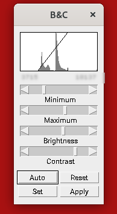

        - The image looks like this:

        

        - Once you're happy with the brightness/contrast,
          - In your lab report, write down the numerical values that are below the histogram in the dialogue box ("B&C").
          - Shut the window. **DO NOT CLICK ON `Apply` AS IT WILL CHANGE THE PIXEL VALUES.**
          - Save a screenshot in your lab report.
4. How does it work?
    - ImageJ holds two copies of the image. One is the original data, in its native format: It is the one used for calculations. The other one is in UINT8 for the visualisation: This is the one displayed on the screen.
    - Let's call the original image  and the visualisation image .

    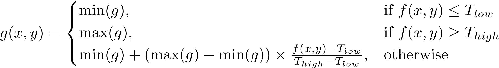

    with: , for black; , for white; , and .

    - Any value below  will be black, and any value above  will be white.

## Area Measurements of an Object

1. Open your lab report from last week. What was the width and height of the PMMA block (not the whole image, just the rectangular structure)?
    - in mm, and
    - in pixels.
2. What is the area of the entire PMMA block in mm2?
    - Tip: Assume the object is a rectangle. 
3. Look at your histograms from last week's report.
    - What was the max pixel value of the background? Let's call it 
    - What was the min pixel value of the PMMA block? Let's call it 
    - What is the pixel value in the middle?
        - Tip: 
        - Write down this number, we'll use it as a "threshold" that will separate the PMMA block from its background.
4. Go to the menu `Image->Adjust->Threshold`.
    - A dialogue box ("Threshold") will appear.

    

    - In the textbox at the top, input the number you just wrote down.
    - In the textbox just below, input the max pixel value of the image (16383).

    You should have something like:

    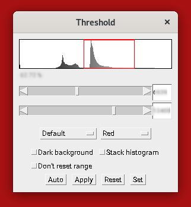

    And the image looks like:

    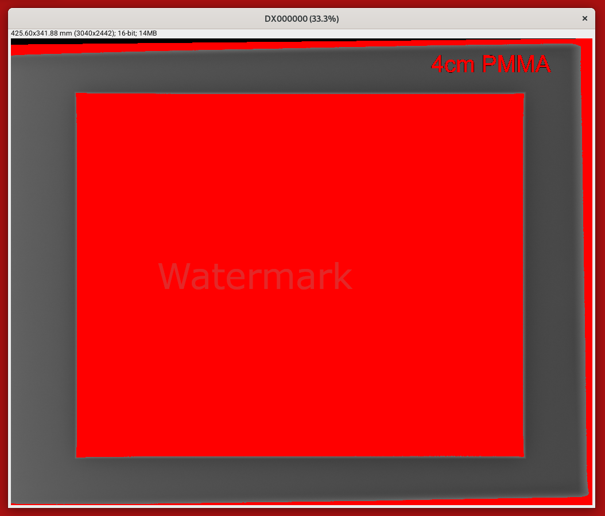
5. The problem is that the text "4cm PMMA" has been selected. It's wrong!
    - Adjust the upper threshold with the corresponding slider so that this text does not show up in red.
    - Add a screenshot of the image in your lab report.
6. Below the histogram in the threshold dialog box, you see a percentage. This is the percentage of pixels of the image that is in red.
    - What is it?
7. Estimate the area of the PMMA block in mm2 using this percentage.
    - Tip: 
8. How does it compare with your previous estimation?
    - Tip: 
    - If the error is greater than 0, then the area is overestimated. If it is lower, it is underestimated.
    - Looking at the segmented image, explain in your own words why the value you computed is greater than 0.

**NOTE:** For a rectangle, we can easily compute the area with , and this is what we did. However, for complex shapes, this method is not possible and we must use the alternative method we just tried (even if it may not be as accurate, this is a trade-off).

## Simulated microtomography of a tungsten fibre

1. Download the file [perfect_CT.tif](https://github.com/effepivi/ICE-3111-Computer_Vision/raw/main/Labs/Lab-02/perfect_CT.tif).
2. Open the file.
3. When we open it, it looks awful: It has a very poor contrast.
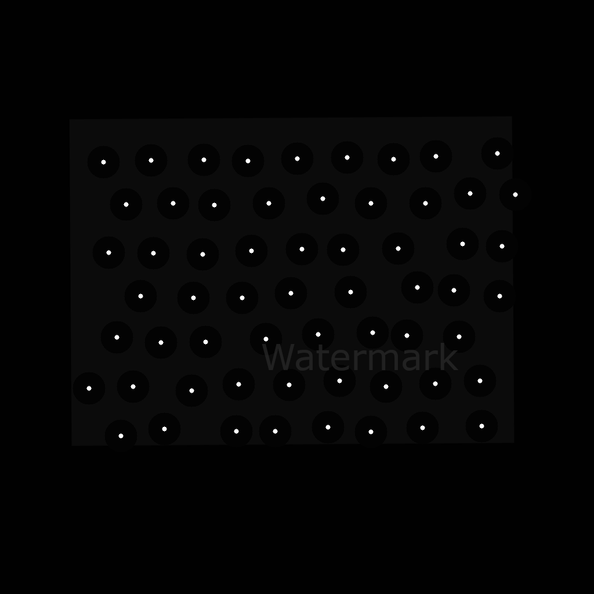
If we investigate a bit. What is the min and max pixel values? The pixel data in a TIFF file is not always in UINT8 (`unsigned char` in C). For this image, you see the data type is FLOAT32. The image is a simulated microtomography slice of a tungsten fibre. Iwan and I use it in our research. There is no limit to what the pixel values can be, which is why floating point numbers are necessary. The smallest pixel value is negative, and the largest is more than 340. The pixel values correspond to "linear attenuation coefficients". These are quantities that characterise how easily X-ray can penetrate a material. 0.0 is easy (vacuum), ~340 is hard (tungsten).

4. Adjust the brightness and contrast so that the image looks nice. Add a screenshot in your lab report.
    - The bright circles correspond to tungsten (W) cores. Tungsten is very dense, which is why the pixels are bright.
    - The dark circles correspond to silicon carbide (SiC). Silicon carbide is very light, which is why the pixels are dark.
    - The rectangular structure (called matrix) is an titanium/aluminum/vanadium alloy (Ti90Al6V4). Ti90Al6V4 is nor heavy, nor light, which is why the pixels are grey.
5. In the TIFF file, the pixel size was not recorded properly. However, we know its value. Adjust the size of pixel.
    - Go to the menu: `Image -> Properties`
    - Change both the pixel width and height to `1.9`
    - Change the units to `um`.

    
6. Similarly to what we did last week, use the line selection tool to 
    1. Measure the diameter in um of one of the bright circles,
    2. Measure the diameter in um of one of the dark circles,
    3. Measure the width and height in um of the rectangular structure.
    - (FYI: Iwan and I conducted a user-study where we asked experts to perform similar measurements. We compared manual measurements with those provided by our computer vision algorithm)
7. What is the percentage of the pixels of the image that corresponds to
    1. Tungsten (bright circles)
    2. Silicon carbide (dark circles), and
    3. Titanium/aluminium/vanadium alloy (rectangular structure).
    - Tip: Use the Threshold dialog box, fiddle with the sliders, note the percentage and compute the area in um2 as we did before.

## Don't forget

To complete the lab report and to submit it.

## Next week

We will start some proper image processing, both in ImageJ and OpenCV.
