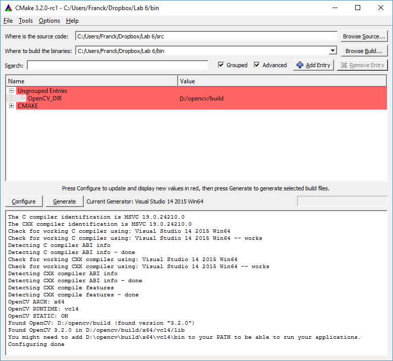

# Instructions in C/C++

## Contents

2. [Load an image](#2-and-3-load-and-display-an-image)
3. [Display an image](#2-and-3-load-and-display-an-image)
4. [Convert a RGB image in a greyscale image](#4-convert-a-rgb-image-in-a-greyscale-image)
5. [Find the smallest and largest pixel values in an image](#5-find-the-smallest-and-largest-pixel-values-in-an-image)
6. [Improve the contrast of an image:](#6-improve-the-contrast-of-an-image)
    1. [by hand using the equation seen in the lecture](#by-hand-using-the-equation-seen-in-the-lecture)
    2. [using OpenCV's function](#using-opencvs-function)
<!-- 7. [Change the dynamic range using a log transform](#7-change-the-dynamic-range-using-a-log-transform)
8. [Blend two images in a for loop to create an animation](#8-blend-two-images-in-a-for-loop-to-create-an-animation) -->

## 2. and 3. Load and display an image

Before we start, the technical documentation is available at: [https://docs.opencv.org/4.5.4/index.html](https://docs.opencv.org/4.5.4/index.html). The OpenCV's functions we will use are:

```cpp
imread() // To read an image from a file
imshow() // To display an image in a window
```
Both functions are available in C, C++ and Python. Find them in the online documentation and read the corresponding text. I often consult the documentation when I forget the name of a function or when I need to find the right sequence of parameters. This is what I get:

```cpp
Mat cv::imread (const String&	filename, int	flags = IMREAD_COLOR );

void cv::imshow (	const String&	winname, InputArray	mat );
```

### Our first OpenCV program

In C and C++, we will use CMake to generate a project that you can use in MS Visual C++ or Apple XCode. CMake relies on a text file called `CMakeLists.txt` to configure the project.

1. Create two new files (`CMakeLists.txt` and `displayImage.cxx`). Make sure the file extensions are correct. MS Windows tend to hide them. **If you are using MS Windows, make sure you show the file extensions in the file explorer!** `CMakeLists.txt` contains:


2. Set the minimum CMake version to at least 3.1. It is needed to enable  the C++ 11 standard.
```cmake
CMAKE_MINIMUM_REQUIRED(VERSION 3.1)
PROJECT(ICE-3111-Lab-Week3)
```

3. C++ 11 is a requirement for OpenCV 4, enable it with:

```cmake
set (CMAKE_CXX_STANDARD 11)
set(CMAKE_CXX_STANDARD_REQUIRED ON)
set(CMAKE_CXX_EXTENSIONS OFF)
```

4. For MS Windows users, add where OpenCV might be installed (look in D: first, then in C:). If you installed OpenCV somewhere else, adjust the path accordingly:

```cmake
IF (WIN32)
    SET (CMAKE_PREFIX_PATH ${CMAKE_PREFIX_PATH} "D:\\opencv\\build")
    SET (CMAKE_PREFIX_PATH ${CMAKE_PREFIX_PATH} "C:\\opencv\\build")
ENDIF (WIN32)
```

5. Find OpenCV
```cmake
FIND_PACKAGE(OpenCV REQUIRED)
```

6. The executable program
```cmake
ADD_EXECUTABLE (displayImage   displayImage.cxx)
```

7. Add OpenCV's header path for the program
```cmake
TARGET_INCLUDE_DIRECTORIES(displayImage PUBLIC ${OpenCV_INCLUDE_DIRS})
```

8. Add OpenCV libraries to each the program
```cmake
TARGET_LINK_LIBRARIES (displayImage   ${OpenCV_LIBS})
```

9. If windows is used, copy the DLLs into the project directory
```cmake
SET (CV_VERSION_STRING ${OpenCV_VERSION_MAJOR}${OpenCV_VERSION_MINOR}${OpenCV_VERSION_PATCH})
IF (WIN32)
    IF ( ${OpenCV_VERSION_MAJOR} EQUAL 4)
        IF (EXISTS "${OpenCV_DIR}/x64/vc15/bin/opencv_videoio_ffmpeg${CV_VERSION_STRING}_64.dll")
            FILE (COPY        "${OpenCV_DIR}/x64/vc15/bin/opencv_videoio_ffmpeg${CV_VERSION_STRING}_64.dll"
                  DESTINATION "${CMAKE_CURRENT_BINARY_DIR}/")
        ELSE ()
            MESSAGE (WARNING "opencv_videoio_ffmpeg${CV_VERSION_STRING}_64.dll is not in ${OpenCV_DIR}/x64/vc15/bin/, you have to make sure is it in the PATH or to copy it manually in your project binary directory")
        ENDIF ()
  ELSE ()
        IF (EXISTS "${OpenCV_DIR}/x64/vc15/bin/opencv_ffmpeg${CV_VERSION_STRING}_64.dll")
            FILE (COPY        "${OpenCV_DIR}/x64/vc15/bin/opencv_ffmpeg${CV_VERSION_STRING}_64.dll"
                  DESTINATION "${CMAKE_CURRENT_BINARY_DIR}/")
        ELSE ()
            MESSAGE (WARNING "opencv_ffmpeg${CV_VERSION_STRING}_64.dll is not in ${OpenCV_DIR}/x64/vc15/bin/, you have to make sure is it in the PATH or to copy it manually in your project binary directory")
        ENDIF ()
  ENDIF ()

    IF (EXISTS "${OpenCV_DIR}/x64/vc15/bin/opencv_videoio_msmf${CV_VERSION_STRING}_64.dll")
        FILE (COPY        "${OpenCV_DIR}/x64/vc15/bin/opencv_videoio_msmf${CV_VERSION_STRING}_64.dll"
              DESTINATION "${CMAKE_CURRENT_BINARY_DIR}/")
    ELSE ()
        MESSAGE (WARNING "opencv_videoio_msmf${CV_VERSION_STRING}_64.dll is not in ${OpenCV_DIR}/x64/vc15/bin/, you have to make sure is it in the PATH or to copy it manually in your project binary directory")
    ENDIF ()

    IF (EXISTS "${OpenCV_DIR}/x64/vc15/bin/opencv_videoio_msmf${CV_VERSION_STRING}_64d.dll")
        FILE (COPY        "${OpenCV_DIR}/x64/vc15/bin/opencv_videoio_msmf${CV_VERSION_STRING}_64d.dll"
              DESTINATION "${CMAKE_CURRENT_BINARY_DIR}/")
    ELSE ()
        MESSAGE (WARNING "opencv_videoio_msmf${CV_VERSION_STRING}_64d.dll is not in ${OpenCV_DIR}/x64/vc15/bin/, you have to make sure is it in the PATH or to copy it manually in your project binary directory")
    ENDIF ()

    IF (EXISTS "${OpenCV_DIR}/x64/vc15/bin/opencv_world${CV_VERSION_STRING}.dll")
        FILE (COPY        "${OpenCV_DIR}/x64/vc15/bin/opencv_world${CV_VERSION_STRING}.dll"
              DESTINATION "${CMAKE_CURRENT_BINARY_DIR}/")
    ELSE ()
        MESSAGE (WARNING "opencv_world${CV_VERSION_STRING}.dll is not in ${OpenCV_DIR}/x64/vc15/bin/, you have to make sure is it in the PATH or to copy it manually in your project binary directory")
    ENDIF ()

    IF (EXISTS "${OpenCV_DIR}/x64/vc15/bin/opencv_world${CV_VERSION_STRING}d.dll")
        FILE (COPY        "${OpenCV_DIR}/x64/vc15/bin/opencv_world${CV_VERSION_STRING}d.dll"
              DESTINATION "${CMAKE_CURRENT_BINARY_DIR}/")
    ELSE ()
        MESSAGE (WARNING "opencv_world${CV_VERSION_STRING}d.dll is not in ${OpenCV_DIR}/x64/vc15/bin/, you have to make sure is it in the PATH or to copy it manually in your project binary directory")
    ENDIF ()
ENDIF (WIN32)    
```

10. Configuring the project using CMake is relatively straightforward. **MAKE SURE YOU USE A GENERATOR THAT SUPPORT 64 BITS.** Every year some people use Win32 instead of Win64. OpenCV is now shipped with the libs compiled in 64 bits only. Win32 won't work.

Do not compile (see "Where to build the binaries:") in the same directory a your source code.



11. Open the project in your favourite IDE, e.g. MS Visual C++ for Windows, XCode for MacOS. Now you can edit `displayImage.cxx`.

12. Add a preamble to `displayImage.cxx`.

Using C++ comments, add a preamble at the top of your file.
It must describe the program:

    1. the author of the program (you),
    2. the date,
    3. the purpose of the file (inc. the command line options),
    4. the todo-list if anything is missing.

13. Header inclusion

OpenCV uses exceptions. To catch them, we need `<exception>`. To display
text in the console `<iostream>` is required. The main OpenCV header is
`<opencv2/opencv.hpp>`.

```cpp
#include <exception> // Header for catching exceptions
#include <iostream>  // Header to display text in the console
#include <opencv2/opencv.hpp> // Main OpenCV header
```

14. Namespaces

We'll use two namespaces `std` for the standard library, and `cv` for OpenCV.

```cpp
using namespace std;
using namespace cv;
```

15. Main structure

As stated previously, OpenCV uses exceptions. We can (or should) catch
them to handle errors. The structure of the main is (almost always):

```cpp
//-----------------------------
int main(int argc, char** argv)
//-----------------------------
{
    try
    {
        // Write your own code here
        //....
        //....
        //....
    }
    // An error occured
    catch (const std::exception& error)
    {
        // Display an error message in the console
        cerr << error.what() << endl;
    }
    catch (const std::string& error)
    {
        // Display an error message in the console
        cerr << error << endl;
    }
    catch (const char* error)
    {
        // Display an error message in the console
        cerr << error << endl;
    }
    catch (...)
    {
        // Display an error message in the console
        cerr << "Unnown error caught" << endl;
    }

#ifdef WIN32
#ifdef _DEBUG
    system("pause");
#endif
#endif

    return 0;
}
```

**Read the code in order to understand what it does. As you can see, I commented pretty much every single line of code.** Right, now we have a general skeleton we can use for any OpenCV program.

Now replace the code
```cpp
// Write your own code here
//....
//....
//....
```
with something useful.

16. Arguments of the Command Line

The first program only takes one parameter. It corresponds to the path
of an image file. To make sure the number of arguments is correct, we use:

```cpp
// Check the command line, do we have two arguments?
// argv[0] is always the executable file
// In our case argv[1] should be the name of an image file
if (argc != 2)
{
    // Create an error message
    std::string error_message;
    error_message  = "usage: ";
    error_message += argv[0];
    error_message += " <input_image>";

    // Throw an error
    throw error_message;
}
```

If there was no error, you can use to get the file name:

```cpp
std::string input_filename(argv[1]);
```

17. Reading the File

An image is stored in an instance of the class `Mat`. Note that OpenCV's
namespace is `cv::`. To declare the variable that will hold our image,
type:

```cpp
// Create an image instance
cv::Mat image;
```

In OpenCV 4, the image is loaded using:

```cpp
// Open and read the image
image = cv::imread( input_filename );
```

It is a good practice to check if any error occurred, e.g. to avoid
unspecified behaviours and crashed. If the image is not loaded, its
`data` field is empty. If it is the case we can throw an error as
follows:

```cpp
// The image has not been loaded
if (!image.data)
{
    // Create an error message
    std::string error_message;
    error_message  = "Could not open or find the image \"";
    error_message += input_filename;
    error_message += "\".";

    // Throw an error
    throw error_message;
}
```

18. Displaying the Image

There are four steps to create a window and display and image:

    1.  Create a string to contain the window title (it is used to identify
        the window);
    2.  Create the window;
    3.  Show the image in the window;
    4.  Wait for a user input to leave the window.

It can be done as follows:

```cpp
// Create a string to contain the window title
string window_title;
window_title  = "My OpenCV Display \"";
window_title += input_filename;
window_title += "\"";

// Create the window
cv::namedWindow(window_title, cv::WINDOW_AUTOSIZE);

// Show the image in the window
cv::imshow(window_title, image);

// Wait for a user input to leave the window
cv::waitKey(0);
```

The program is now complete. You can compile it and run it with
different image files to test it.
In your lab report, you must include a listing of your program and put three screenshots (with three different images).

## 4. Convert a RGB image in a greyscale image.

1. Copy paste your previous program in a new one that you call `rgb2grey.cxx`. Don't forget to edit `CMakeLists.txt` and add:

```cmake
ADD_EXECUTABLE (rgb2grey   rgb2grey.cxx)
TARGET_INCLUDE_DIRECTORIES(rgb2grey PUBLIC ${OpenCV_INCLUDE_DIRS})
TARGET_LINK_LIBRARIES (rgb2grey   ${OpenCV_LIBS})
```

2. The command line is:

```bash
rgb2grey  input_filename  output_filename
```

Change the code appropriately.

```cpp
// Check the command line, do we have three arguments?
// argv[0] is always the executable file
// In our case argv[1] should be the name of an input image file
// In our case argv[2] should be the name of an output image file
if (argc != 3)
{
    // Create an error message
    std::string error_message;
    error_message  = "usage: ";
    error_message += argv[0];
    error_message += " <output_image> <>";

    // Throw an error
    throw error_message;
}

std::string input_filename(argv[1]);
std::string output_filename(argv[2]);
```

Make sure you change the `2` into `3`, and that you retreive filename of the output image (`argv[2]`).
In future, I may not provide the same level of guidance for this task as I will assume it is something you know now.

3. After you read the image and checked that the image was loaded, and before displaying the image, convert it into a greyscale image:

```cpp
cv::Mat grey_image;
cv::cvtColor(image, grey_image, cv::COLOR_RGB2GRAY);
```

4. Don't forget to display the right image, i.e. `grey_image` not `image`. `imshow` will take care of the change of pixel type (RGB->greyscale).

5. Save the image

The function to save an image is `cv::imwrite(file_name, image)`. It
returns true if the file has been successfully written; false otherwise.
We can use the return value to handle possible errors:

```cpp
// Write the image
if (!cv::imwrite(output_filename, grey_image))
{
    // The image has not been written

    // Create an error message
    std::string error_message;
    error_message  = "Could not write the image \"";
    error_message += output_filename;
    error_message += "\".";

    // Throw an error
    throw error_message;
}
```

When you detect an error, it is good practive to throw an error. Again, I will assume from now on that you know how to do it.

The program is now complete. You run it with different image files to test it. In your lab report, you must include a listing of your program and put three screenshots (with three different images).

## 5. Find the smallest and largest pixel values in an image.

### Create a test image

- Choose an image of your choice.
- If it looks nice (i.e. has a good contrast/brightness in our case), we will make it dull, sorry.
- Open the image in ImageJ.
- Go to the menu `Image->Type` and choose `8-bits` to convert it to greyscale.
    - In the lab report, add the histogram of this image.
- In the menu `Process->Math`, choose `Divide`. Use `3` or `4`.
    - In the lab report, add the histogram of this new image.
    - See the histogram? You just altered the contrast. Ooops.
- In the menu `Process->Math`, choose `Add`. Use `25` or something along these lines.
    - In the lab report, add the histogram of this new image.
    - See the histogram? You just altered the brightness. Ooops.
- Save the image as a `TIFF` file.
- In the lab report, add a screenshot of this new image.

### OpenCV code

- To create the new program, copy paste `rgb2grey.cxx` into `contrastStretchingManual.cxx`. Do not forget to edit `CMakeLists.txt` as you did previously.
- To retrieve the smallest and largest pixel values in `grey_image`, we will use
```cpp
void cv::minMaxLoc 	( 	InputArray  	src,
		double *  	minVal,
		double *  	maxVal = 0,
		Point *  	minLoc = 0,
		Point *  	maxLoc = 0,
		InputArray  	mask = noArray()
	) 		
```
We can use  it as follows:
`cv::minMaxLoc(your_mat, &minVal, &maxVal)`, where `your_mat` is a `cv::Mat` (`grey_image` in our program), `minVal` and `maxVal` are two double-precision floating point numbers (don't forget to declare the variables).
- After you called `minMaxLoc` with the appropriate parameters, output the value with something like:
```cpp
cout << "min value:\t" << minVal << endl;
cout << "max value:\t" << maxVal << endl;
```
- To test your program, run your program with your new test image.
- In your lab report, add a screenshot of the console with the output.
- Open test image with ImageJ. Go to the menu `Analyze -> Measure`.
- In your lab report, add a screenshot of the table from ImageJ that displays the min and max values.
- Are the values identical?

## 6. Improve the contrast of an image

### by hand using the equation seen in the lecture

You need to be familiar with the histogram stretching method we saw in the lecture. It's equation is


In our case,

- `g` is a new `cv::Mat` to store the new image,
- `f` is `grey_image`,
- *min(g) = 0*
- *max(g) = 255*
- *Tlow = minVal*
- *Thigh = maxVal*

- Remember `1 / 2 = 0`, and `1.0 / 2.0 = 0.5`. Due to the division, we *MUST* make sure floating-point divisions are used instead of integer division.
- For this purpose we use:
```cpp
void cv::Mat::convertTo 	( 	OutputArray  	m,
		int  	rtype,
		double  	alpha = 1,
		double  	beta = 0
	) 		const
```
- First, create a new image, e.g. `cv::Mat float_image;` and use
- `grey_image.convertTo(float_image, CV_32FC1);`.
- where `32F` means single precision floating-point number, and `C1` means greyscale (one colour channel).
- Now we can apply the equation:
    - Subtraction: `float_image -= minVal;`
    - Division: `float_image /= maxVal - minVal;`
    - Product: `float_image *= 255;`
- Display `float_image` using `imshow`.
- Add a screenshot in your report.
- Why was the image (mostly) white?
    - Hint, look at [http://scikit-image.org/docs/dev/user_guide/data_types.html](http://scikit-image.org/docs/dev/user_guide/data_types.html) and find the corresponding data type.
    - For an image in floating-point numbers, by convention what is the value of white?
- We must convert the image from floating-point numbers to unsigned bytes (UINT8).
- Create a new image that you call `uint8_image`.
- Call `float_image.convertTo(uint8_image, CV_8UC1);`.
- Display `uint8_image` using `imshow`.
- Add a screenshot in your report.
- Alter the call to `imwrite` to save `uint8_image` into a file.

The program is now complete. You run it with your test image.
In your lab report, you must include a listing of your program.

### using OpenCV's function

- There is a function in OpenCV to perform the histogram stretching operation. It's called "min-max normalisation":

```cpp
void cv::normalize 	( 	InputArray  	src,
		InputOutputArray  	dst,
		double  	alpha = 1,
		double  	beta = 0,
		int  	norm_type = NORM_L2,
		int  	dtype = -1,
		InputArray  	mask = noArray()
	) 	
```

In our context, `alpha` is 255, and `norm_type` is `NORM_MINMAX`.

- To create the new program, copy paste `contrastStretchingManual.cxx` into `contrastStretchingCV.cxx`. Do not forget to edit `CMakeLists.txt` as you did previously.

- Remove the code that you added for the histogram stretching. It includes the call to `cv::minMaxLoc` as it will done internally by `cv::normalize`. Remove all the variables that you no longer need.

- All we need to do is:

```cpp
Mat float_image;
Mat uint8_image;
normalize(grey_image, float_image, 255, 0, NORM_MINMAX);
float_image.convertTo(uint8_image, CV_8UC1);
```

The program is now complete. You run it with your test image.
In your lab report, you must include:

- a listing of your program,
- a screenshot of the new image after histogram stretching, and
- a screenshot of its histogram in ImageJ.

<!-- ## 7. Change the dynamic range using a log transform.

## 8. Blend two images in a for loop to create an animation. -->


## Don't forget

To complete the lab report and to submit it.

## Next time

We will use spatial filters to blur an image, find edges, etc.
