#  From motion detection to motion tracking and motion estimation in C/C++

We'll create 1 program only today.
I suggest that you keep in in the same folder as last week's lab as we are going to use the same data.

1. Copy `motionDetection.cxx` into `motionTracking.cxx`
2. In `motionTracking.cxx`, add a preamble using C/C++ comments. The preamble must describe the program:

    1. the author of the program (you),
    2. the date,
    3. the purpose of the file (inc. the command line options),
    4. the todo-list if anything is missing.

3. Edit `CMakeLists.txt` to add the new program.
(you must add 3 lines)

## Contents

1. [Changes of illumination](#1-changes-of-illumination),
2. [Clean the foreground mask](#2-clean-the-foreground-mask),
3. [Identify the moving objects](#3-identify-the-moving-objects),
4. [Highlight moving objects in the original video](#5-highlight-moving-objects-in-the-original-video),
5. [Track the position of each moving object](#4-track-the-position-of-each-moving-object), and
6. [Remove static objects if any](#6-remove-static-objects-if-any).

**NOTE: You must test your new program (`motionTracking.cxx`) with the 3 videos I provided. You can use other videos too, but you must at least demonstrate that your code works with the one I provided."**

# 1. Changes of illumination

In the following video, the lighting condition will change.

[](https://www.fpvidal.net/ICE3111/change_of_lighting_conditions.avi)

The light was off at the beginning of the recording. I asked someone to turn it on during the recording.

|  | Light off | Light on |
|--|-----------|----------|
| Original frame | 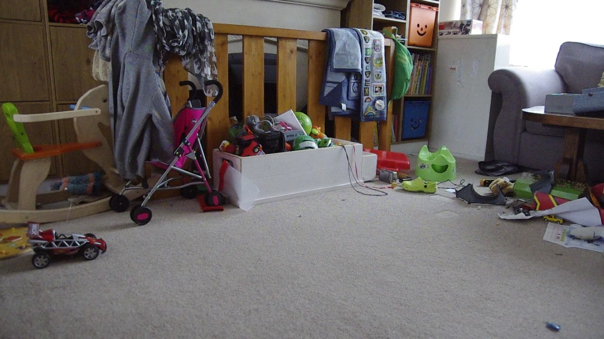     | 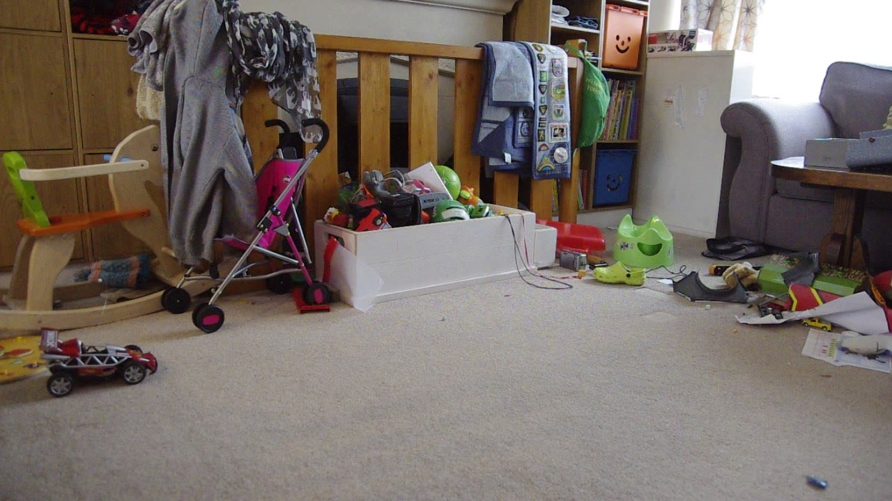    |
| Greyscale | 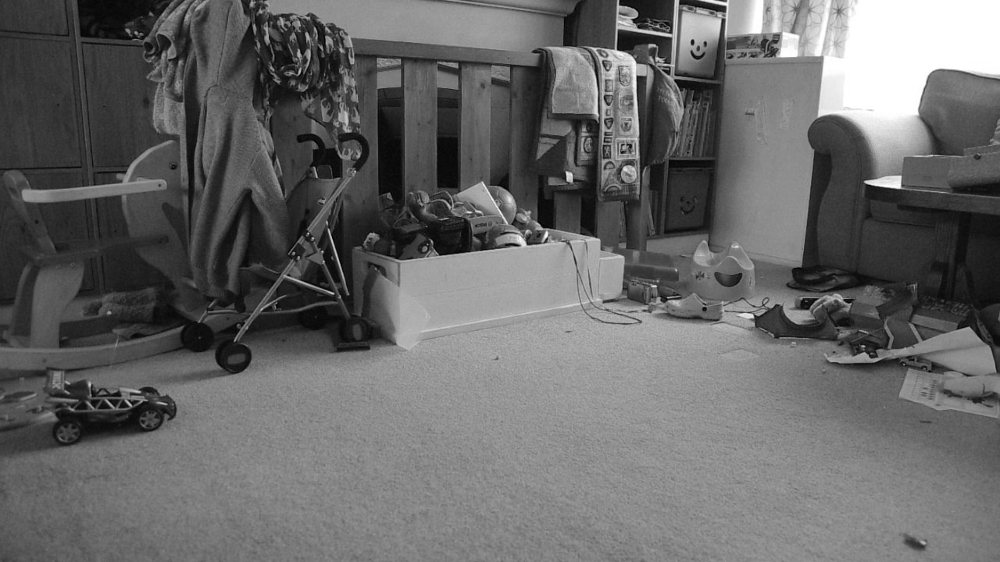     |     |
| Histogram of greyscale | 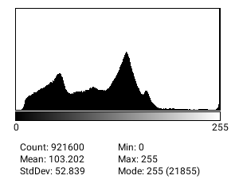     | 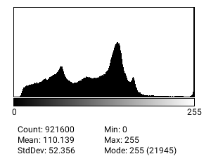    |

The absolute difference between the two greyscale images is:

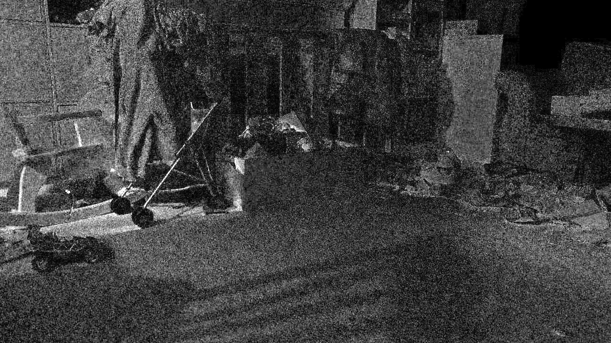

Bright pixels show pixels whose intensity has changed considerably.
We can see two things:

- the noise is an important factor,
- the change of illumination is also an important factor.

We must mitigate for both.

## Noise

To account for the noise, we can smooth the images with a median filter. Below I used a 5x5 filter:

|  | Light off | Light on |
|--|-----------|----------|
| Greyscale |      |     |
| Smoothed | 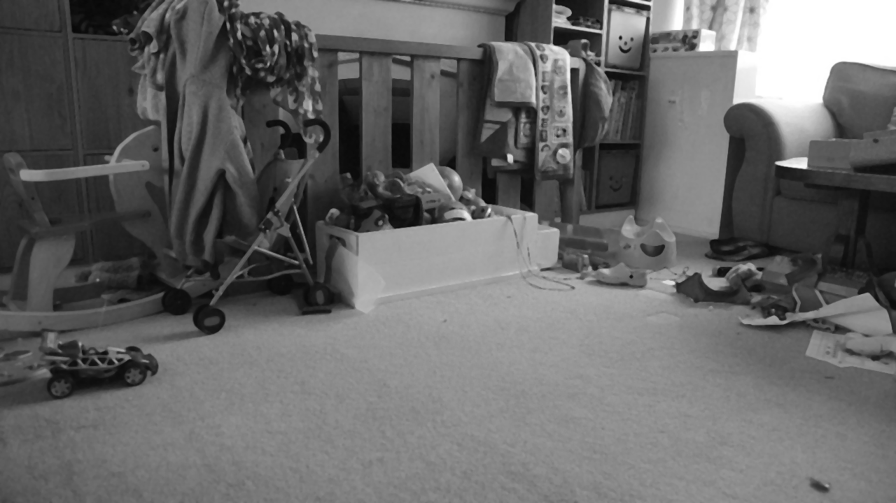     |     |

The absolute difference becomes:

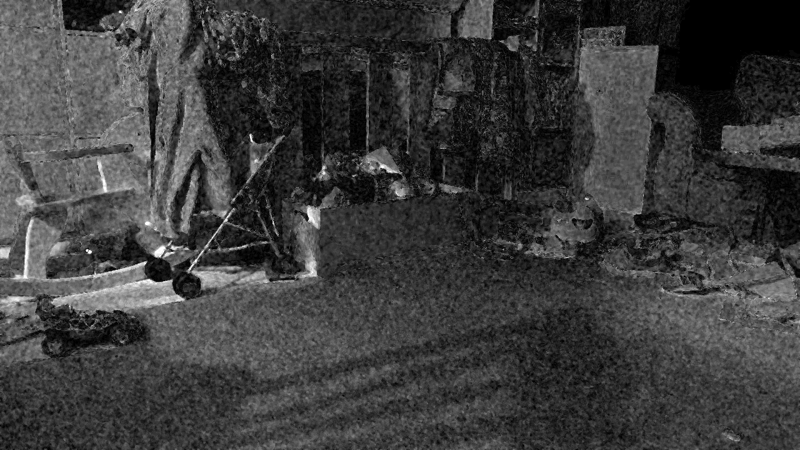

The effect of the noise has been attenuated.

### Edit `motionTracking.cxx`

1. Filter the background with a median filter. You can use a 5x5 filter as follows:

```cpp
cv::medianBlur(background, background, 5);
```

(the 1st occurence of `background` is the input image, the 2nd occurence is the output image, `5` is the size of the filter)

You may experiment different values.

2. In the `while` loop, backup the incoming frame before you process it.

    - Just after the call to `video_input >> frame`, backup the frame with `cv::Mat frame_backup = frame.clone();`
    - Once the frame is backed up, filter the incoming `frame` with the same filter.

3. Run and test your program using several videos.
In your report, document what changes you made in your code and document your tests. You must add screenshots.

### Change of illumination

The zero-mean, unit-variance normalisation (or standardisation as it is called in machine learning) is a popular technique in computer vision to address changes of illumination. After this operation, the average pixel value is zero, and the standard deviation is one.

### Edit `motionTracking.cxx`

1. After filtering the background with the median filter, and after the conversion to greyscale, apply the normalisation with:

```cpp

cv::Scalar mean, stddev;
cv::meanStdDev(background, mean, stddev);
background.convertTo(background, CV_32F);
background -= mean;
background /= stddev;
```

**NOTE: that it is important to convert the pixel data to floating-point numbers.**

2. In the `while` loop, do the same for the incoming `frame`.
**Note that `imshow("foreground", foreground);` may display a black image as the range of pixel values is  no longer valid.**

3. Fix the display if needed by replacing

```cpp
imshow("foreground", foreground);
```

with

```cpp
double min_val, max_val;
cv::minMaxLoc(foreground, &min_val, &max_val);
imshow("foreground", (foreground - min_val) / (max_val - min_val));
```

4. Change the threshold. Try `1`. Try other values until you are satisfied with the threshold.

5. Test your code and document in your report what changes you made to your code. You must add screenshots.

# 2. Clean the foreground mask

Now, we want

1. to remove tiny islands from the foreground mask, and
2. fill small holes.

as follows:


| Before cleaning | After cleaning |
|-----------------|----------------|
| 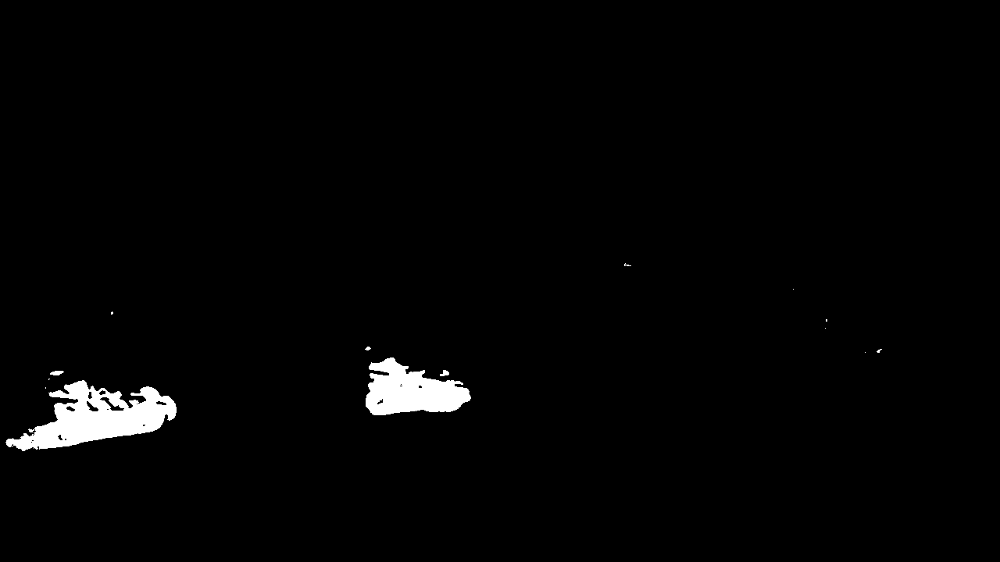 |  |

A median filter could do the job, however a large size might be required. We will prefer using mathematical morphology instead.

1. Make sure your binary mask is in the right format. Replace `cv::cvtColor(foreground_mask, foreground_mask, COLOR_GRAY2BGR);` with `            foreground_mask.convertTo(foreground_mask, CV_8U);
`. It is now a greyscale image in unsigned byte.

2. Filter `foreground_mask` as follows:

```cpp
int element_size = 13;
cv::Mat structuring_element = getStructuringElement( cv::MORPH_ELLIPSE, cv::Size( element_size, element_size ) );
cv::morphologyEx( foreground_mask, foreground_mask, cv::MORPH_CLOSE, structuring_element );
cv::morphologyEx( foreground_mask, foreground_mask, cv::MORPH_OPEN, structuring_element );
```

**NOTE: you can only apply these operation on the greyscale image in unsigned byte, i.e. AFTER you called `foreground_mask.convertTo(foreground_mask, CV_8U);`.**

3. Change the size of the structuring element you are satisfied with its value.

**NOTE: make sure you call ` imshow("foreground_mask", foreground_mask)` AFTER the mathematical morphology operations.**
`
4. Run and test your program using several videos and several sizes of structuring element.
In your report, document what changes you made in your code and document your tests. You must add screenshots.

# 3. Identify the moving objects

To find the objects highlighted in white in `foreground_mask`, we need to find the contours:

```cpp
std::vector<std::vector<cv::Point> > contours;
std::vector<cv::Vec4i> hierarchy;

cv::findContours( foreground_mask, contours, hierarchy, cv::RETR_LIST, cv::CHAIN_APPROX_SIMPLE);
```

# 4. Highlight moving objects in the original video

We will only draw a contour if it is big enough (whatever big enough might be). We will draw it over the `frame_backup`.

Your output video should look like this:

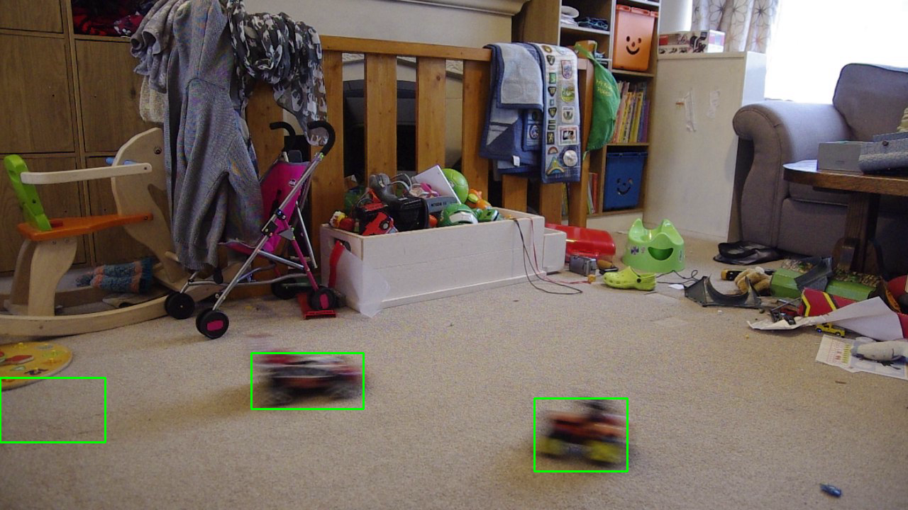

```cpp
for (auto cnt = contours.begin(); cnt != contours.end(); cnt++)
{
    if (cv::contourArea(*cnt) > 0.1 / 100.0 * frame_backup.rows * frame_backup.cols)
    {
        cv::Scalar colour(0,255,0);
        cv::Rect bounding_box = cv::boundingRect(*cnt);
        cv::rectangle( frame_backup, bounding_box.tl(), bounding_box.br(), colour, 2 );
    }
}
```

In the code above, a contour is big enough if its area is larger than 0.1% of the area of the whole image.
You may have to tweak this number.

**NOTE: Make sure that this is `frame_backup` that is written in `video_output`.**

**NOTE: Make sure that this is `frame_backup` that is displayed instead of `frame` in "`Input video`". Make sure that you move the corresponding `imshow` at the end of the while loop.**

Again, document your tests in your report.

# 5. Track the position of each moving object

- Now we can display "Object 0" for the 1st object, "Object 1" for the 2nd  object, etc. with

We use `int i = cnt - contours.begin();` to retrieve the contour's index.

```cpp
cv::putText(frame_backup,
            "Object " + std::to_string(i),
            cv::Point(int(bounding_box.x + bounding_box.width / 2), int(bounding_box.y + bounding_box.height / 2)),
            cv::FONT_HERSHEY_COMPLEX_SMALL,
            2,
            255);
```

I get something like:

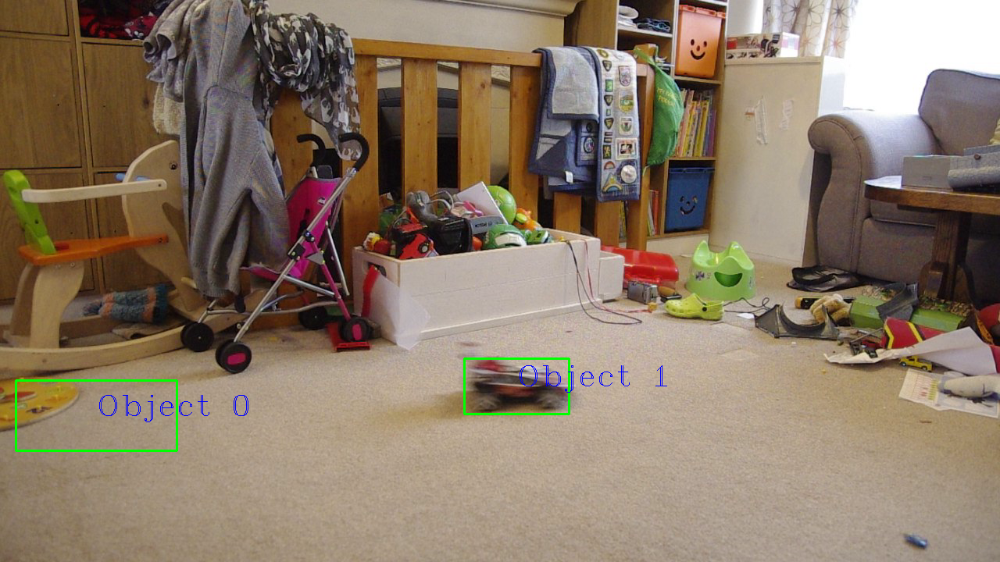

Again, document your tests in your report.

# 6. Remove static objects if any

In the image above, you can see that `Object 0` is not actually an object that moves. You must find a way to ignore contours of all the objects that are not moving between successive frames as illustrated in:

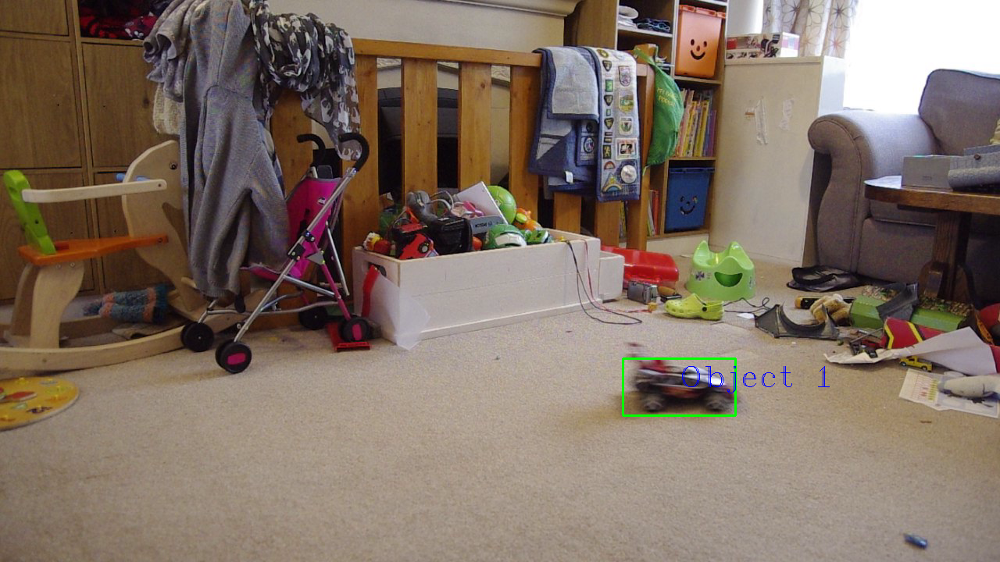

You could

1. update the background, and this is something we discussed in the lecture.
2. Alternatively, for each iteration of the while loop, you could
    1. backup the centre of the contours of the previous frame
    2. for each contour of the new frame,
        - if all the contour of the previous frame are far enough,
        - then consider the object is moving,
        - else consider that it is static (hence part of the background).
