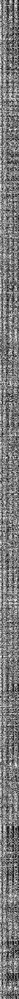
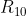
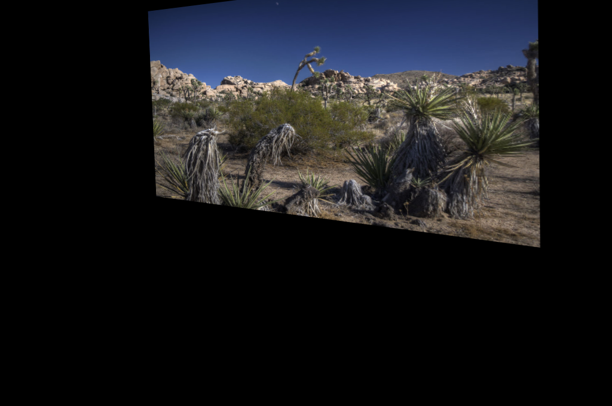
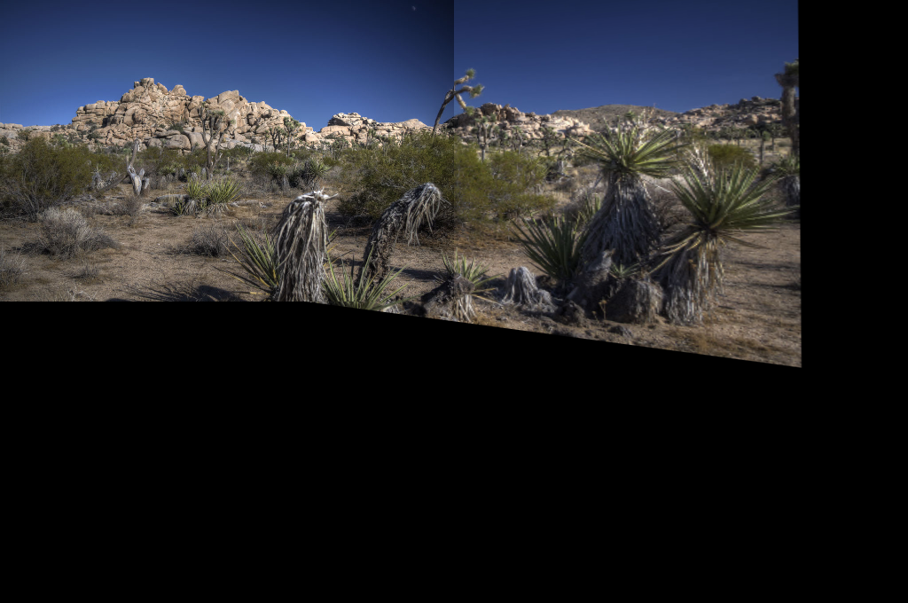
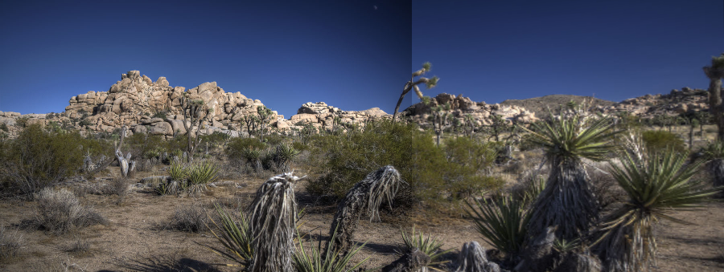

# Lab 8 -- Panorama stitching using OpenCV's Feature Detection and Tracking Framework in Python

# Preliminaries

- **You must make sure you save ALL the images created within your image stitching pipeline, including intermediate images, as evidence of testing**. You must add these images in your report to document your tests.
    - You may use `imwrite` or `imshow` with screenshots.
    - For one iteration of the stitching, you'll create 7 images:
        - Left image,
        - Right image,
        - All the matches (image created using `drawMatches`),
        - Good matches only (image created using `drawMatches`),
        - Right image after transformation (i.e. the result of `warpPerspective`),
        - Stitching before cropping, and
        - Stitching after cropping.
- Go to the same directory as the one you used for previous labs.
- You'll write your code in a single file: `panorama.py`

    - Create the new file, `panorama.py`
    - Add a preamble using Python comments. The preamble must describe the program:

        1. the author of the program (you),
        2. the date,
        3. the purpose of the file (inc. the command line options),
        4. the todo-list if anything is missing.

- There are 2 sets of image files to test your code. Download them using  the links below:
    <!-- - [left-1.jpg](left-1.jpg)
    - [right-1.jpg](right-1.jpg) -->
    - [left-2.jpg](left-2.jpg)
    - [right-2.jpg](right-2.jpg)
    - [left-3.jpg](left-3.jpg)
    - [centre-3.jpg](centre-3.jpg)
    - [right-3.jpg](right-3.jpg)
- Move them in the same directory as `panorama.py`.

# Have you done your homework?

This lab relies on the lectures of:
  - Week 9 on Feature Detection and Tracking, and
  - Week 10 on Transformations and Panoramas.

Make sure you are up-to-date with the lectures. There are slides, recordings, and Jupyter notebooks. They'll help you understanding the lab. In particular, you are expected to have studied the code in the following Jupyter Notebook:

[https://github.com/effepivi/ICE-3111-Computer_Vision/blob/main/Lectures/Week09-Feature_detection/1-detect-describe-match-using-ORB-in-opencv-python.ipynb](https://github.com/effepivi/ICE-3111-Computer_Vision/blob/main/Lectures/Week09-Feature_detection/1-detect-describe-match-using-ORB-in-opencv-python.ipynb).

You must **read and understand** both 1) the text in English and 2) the code.

# Import packages

I would use the usual suspects:

- `sys` for the command line arguments and `sys.float_info.max`
- `numpy as np` (who does not use Numpy?!)
- `cv2` for OpenCV

# Inputs/output

The program will load at least two images and generate a new image. The most elegant way to handle this is to use the command line arguments. I would use:

```bash
$ python3 panorama.py left-1.jpg right-1.jpg panorama-1.jpg
$ python3 panorama.py left-2.jpg middle-2.jpg right-2.jpg panorama-2.jpg
```

There must be at least 4 arguments (`len(sys.argv) >= 4`). The 1st one (`sys.argv[0]`) is always the executable program (`panorama`). The last argument is the output file (`sys.argv[len(sys.argv) - 1]`).
Other arguments correspond to the input image filenames (from left to right).

You can of course hard-code the filenames for now, but it is not as flexible as the command line.
Mark will be deducted if filenames are hard-coded.

# Computer Vision Pipeline to Stitch Images Together

Look at the pipeline below. There are 7 main steps:

1. Opening the left and right images (Steps `[2]` & `[3]` of the notebook).
2. For each image, find features (also called keypoints) (Steps `[5]` & `[6]`).
3. For each image, extract the features (also called describe the features) (Steps `[11]` & `[12]`).
4. For each feature of each image, find the corresponding feature in the other image (Step `[15]`).
5. Only keep "good matches" (Steps `[16]` & `[19]`).
6. Find the matrix that transforms the position of the features in one image into the position of the corresponding features in the other image.
7. Apply the transformation on one image and stitch it with the other one.


# Adapt the code from the Jupyter Notebook

Steps 1 to 5 of the overall pipeline are already covered in one of the notebook seen in the lecture. You'll complete it in your own program ([see here](https://github.com/effepivi/ICE-3111-Computer_Vision/blob/main/Lectures/Week09-Feature_detection/1-detect-describe-match-using-ORB-in-opencv-python.ipynb)). You can use it as a starting point. Note that Steps after `[20]` may not be useful for the lab.

Note that I wrote a function to crop images. You'll need it:

```python
def autoCrop(anImage: np.array) -> np.array:

    # Convert to grey scale
    grey_image = cv2.cvtColor(anImage, cv2.COLOR_BGR2GRAY)

    # Convert to binary
    binary_image = cv2.threshold(grey_image, 1, 255, cv2.THRESH_BINARY)[1]

    # Initialise the size of the bounding box
    width = binary_image.shape[1]
    height = binary_image.shape[0]

    # Crop along the horizontal axis
    for y in range(binary_image.shape[0] - 1, 1, -1):
        still_black = True
        for x in range(binary_image.shape[1] - 1, 1, -1):
            if binary_image[y,x] != 0 and still_black:
                still_black = False

                if width > x:
                    width = x

    # Crop the image
    binary_image = binary_image[0:height, 0:width]

    # Crop along the vertical axis
    for x in range(binary_image.shape[1] - 1, 1, -1):
        still_black = True
        for y in range(binary_image.shape[0] - 1, 1, -1):
            if binary_image[y,x] != 0 and still_black:
                still_black = False

                if height > y:
                    height = y

    # Apply the bounding box
    return anImage[0:height, 0:width]
```

1. Import the left (`left_image`) and right (`right_image`) images (use `cv::imread`) (Steps `[2]` & `[3]` of the notebook):
    - Use `imshow` to check if the images are fine.
    - Test your program.
2. For each image, detect keypoints (Steps `[5]` & `[6]`):
    - Create a feature detector, e.g. using the Oriented FAST and Rotated BRIEF (ORB) method.
    - Detect the keypoints in `left_image` and `right_image`.
3. For each keypoint, describe features (Steps `[11]` & `[12]`):
    - Create a compatible feature extractor:
    - Create the feature vector for the keypoints.

    The keypoint descriptors of an image is a huge matrix, with one row per keypoint, one column per feature.
    - **SAVE THE FEATURE DESCRIPTOR OF ONE OF THE IMAGES, AND ADD IT TO YOUR REPORT.** This is to test that the code is working well.
    - Test your program.

    <!--  -->
    <!--  -->

4. Pairwise matching between the features of the left and right images (Step `[15]`):
    - Match keypoints in `left_image` and `right_image` by comparing their corresponding feature vectors. Here we use a brute-force algorithm and the [Hamming distance](https://en.wikipedia.org/wiki/Hamming_distance).

5. Now the features have been matched, we need to filter the result (Steps `[16]` & `[19]`). We want to limit the number of false-positives: Only small distances are valid. Create two variables to store the smallest and largest distance between two features of `matches`.
    - We will only consider matches whose distance is less than a given threshold, e.g. `threshold = min_dist + (max_dist - min_dist) / 2.0`.
    - __IN YOUR REPORT, USE `cv::drawMatches` TO SHOW THE GOOD MATCHES (Step `[20]`).__
    *Drawing the good matches will help you in adjusting the threshold (if needed, of course). You could even add a slider (trackbar) to do it interactively*.
    - Test your program.

6. Warping images (compute the projection matrix ).
During this step, we need to compute the transformation matrix that will convert the 2D positions of the keypoints of one image into the same space as the ones of the other image.
    - First of all, we need to store the 2D positions of the keypoints for both images. We create two STL vectors of `Point2f`
(one per set of keypoints):
    ```python
    left_image_point_set = []
    right_image_point_set = []
    ```
    - Now we look at each good match in `good_matches` and add the corresponding 2D points to the corresponding vector:
    ```python
    # Look at each good match
    for i in range(len(good_matches)):

        # Get the keypoints from the good match
        left_image_keypoint = left_image_keypoints[good_matches[i].queryIdx]
        right_image_keypoint = right_image_keypoints[good_matches[i].trainIdx]

        # Add the corresponding 2D points
        left_image_point_set.append(left_image_keypoint.pt);
        right_image_point_set.append(right_image_keypoint.pt);

    # Convert to numpy arrays
    left_image_point_set = np.array(left_image_point_set)
    right_image_point_set = np.array(right_image_point_set)
    ```
    - Now, we need to find the perspective transformation between two planes to transform the
    coordinates in `left_image_point_set` into the same plane as the coordinates in
    `right_image_point_set`. We use the RANdom SAmple Consensus (RANSAC) algorithm to do so:
    ```python
    homography_matrix = cv2.findHomography(right_image_point_set,
            left_image_point_set,
            cv2.RANSAC)
    ```

7. Then we apply the new transformation matrix to deform the image, then we crop it:
    ```python
    panorama_image = cv2.warpPerspective(right_image, homography_matrix[0],
        (
            left_image.shape[1] + right_image.shape[1],
            left_image.shape[0] + right_image.shape[0])
        )
    ```
    I used `imshow` for debugging purposes.
    
    - Test your program.
    - Add the corresponding image in your report.

8. Now we can copy the left image onto the transformed right image:
    ```cpp
    panorama_image[0:left_image.shape[0], 0: left_image.shape[1]] = left_image
    ```
    

    - Test your program.
    - Add the corresponding image in your report.

9. Now we can crop the image with the autoCrop function I provided:
    ```cpp
    panorama_image = autoCrop(panorama_image);
    ```
    

    - Test your program.
    - Add the corresponding image in your report.

10. **Additional work:** Use a slider to adjust threshold using a trackbar.
    - Add evidence in your report

11. **Additional work:** Make it possible to stitch together 3 or more images.
    1. make sure you use the command line arguments to load the image files,
    2. at the end of the stitching, `panorama_image` becomes `left_image`,
    3. add a for loop to repeat the main steps.

    - Add evidence of testing in your report
